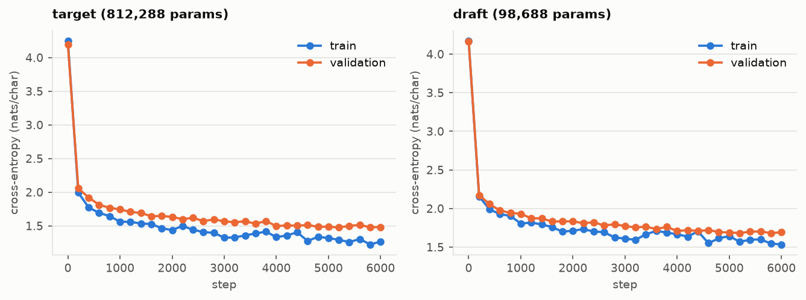
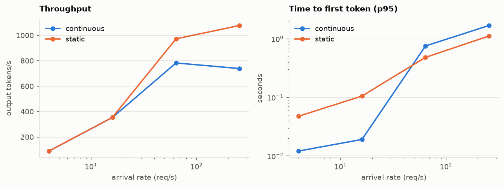
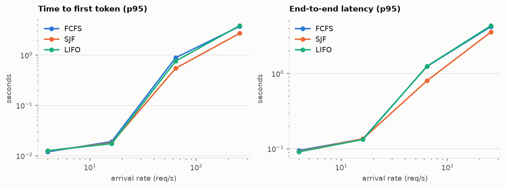
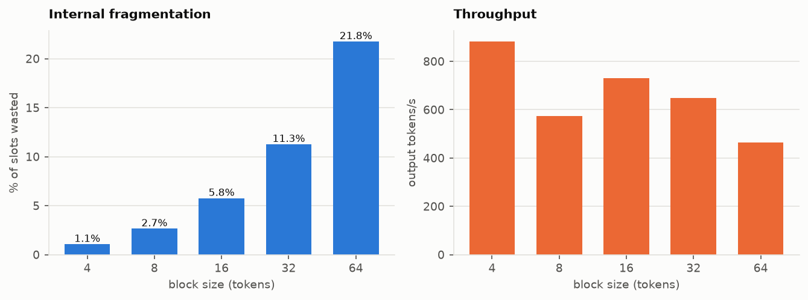
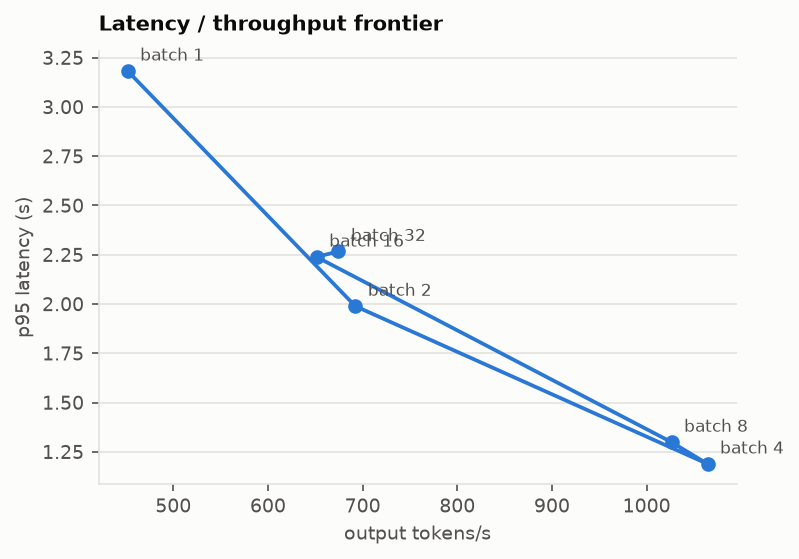
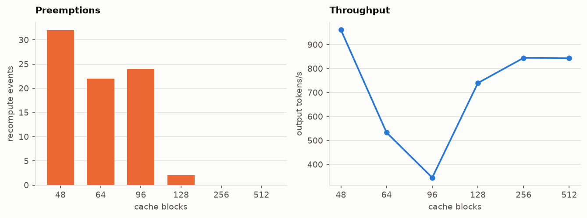
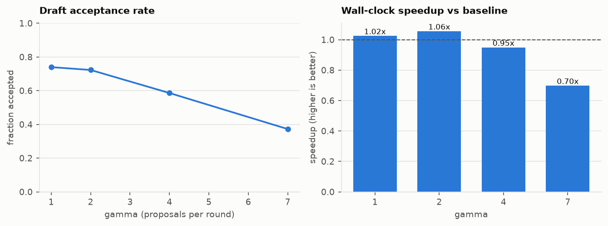

# Results

Generated by `python scripts/report.py`. Every number here comes from the JSON under `artifacts/`, produced on a single CPU thread (`--threads 1`); absolute rates are therefore small, and the shape of each curve is the point rather than its height.

## Models

| model | params | layers | d_model | heads | best val loss | train time (min) |
|---|---|---|---|---|---|---|
| target | 812,288 | 4 | 128 | 4 | 1.4750 | 25.5 |
| draft | 98,688 | 2 | 64 | 2 | 1.6815 | 7.1 |

## Continuous vs static batching

| mode | req/s | tok/s | TTFT p50 (ms) | TTFT p95 (ms) | lat p95 (s) | mean batch | mean util | preempt |
|---|---|---|---|---|---|---|---|---|
| continuous | 4.0 | 89.9 | 8 | 12 | 0.107 | 1.10 | 0.02 | 0 |
| static | 4.0 | 89.9 | 8 | 48 | 0.106 | 1.01 | 0.01 | 0 |
| continuous | 16.0 | 354.3 | 8 | 19 | 0.134 | 1.56 | 0.02 | 0 |
| static | 16.0 | 354.9 | 15 | 105 | 0.178 | 1.27 | 0.02 | 0 |
| continuous | 64.0 | 783.2 | 57 | 755 | 1.142 | 7.74 | 0.11 | 0 |
| static | 64.0 | 973.2 | 190 | 482 | 0.587 | 3.87 | 0.05 | 0 |
| continuous | 256.0 | 739.3 | 689 | 1686 | 1.937 | 12.15 | 0.17 | 0 |
| static | 256.0 | 1078.0 | 540 | 1116 | 1.214 | 6.33 | 0.09 | 0 |

## Scheduling policy

| policy | req/s | tok/s | TTFT p50 (ms) | TTFT p95 (ms) | lat p95 (s) | mean batch | mean util | preempt |
|---|---|---|---|---|---|---|---|---|
| fcfs | 4.0 | 89.9 | 7 | 12 | 0.095 | 1.10 | 0.02 | 0 |
| sjf | 4.0 | 89.9 | 7 | 13 | 0.092 | 1.08 | 0.01 | 0 |
| lifo | 4.0 | 89.9 | 7 | 13 | 0.091 | 1.09 | 0.02 | 0 |
| fcfs | 16.0 | 355.4 | 8 | 19 | 0.135 | 1.54 | 0.02 | 0 |
| sjf | 16.0 | 355.1 | 7 | 18 | 0.136 | 1.54 | 0.02 | 0 |
| lifo | 16.0 | 354.5 | 7 | 17 | 0.133 | 1.56 | 0.02 | 0 |
| fcfs | 64.0 | 740.9 | 89 | 887 | 1.242 | 8.68 | 0.12 | 0 |
| sjf | 64.0 | 953.9 | 33 | 546 | 0.802 | 6.12 | 0.08 | 0 |
| lifo | 64.0 | 749.6 | 33 | 760 | 1.250 | 6.14 | 0.08 | 0 |
| fcfs | 256.0 | 364.8 | 1858 | 3714 | 4.215 | 12.52 | 0.17 | 0 |
| sjf | 256.0 | 432.6 | 1009 | 2702 | 3.562 | 13.02 | 0.18 | 0 |
| lifo | 256.0 | 356.0 | 1536 | 3835 | 4.336 | 12.42 | 0.17 | 0 |

## KV block size

| block size | req/s | tok/s | TTFT p50 (ms) | TTFT p95 (ms) | lat p95 (s) | mean batch | mean util | preempt |
|---|---|---|---|---|---|---|---|---|
| 4 | - | 882.1 | 37 | 582 | 0.909 | 6.14 | 0.08 | 0 |
| 8 | - | 574.1 | 280 | 1540 | 1.905 | 7.59 | 0.10 | 0 |
| 16 | - | 730.5 | 42 | 990 | 1.316 | 6.28 | 0.09 | 0 |
| 32 | - | 649.2 | 38 | 1161 | 1.578 | 5.86 | 0.09 | 0 |
| 64 | - | 463.2 | 123 | 2230 | 2.572 | 9.01 | 0.15 | 0 |

## Batch size frontier

| max batch | req/s | tok/s | TTFT p50 (ms) | TTFT p95 (ms) | lat p95 (s) | mean batch | mean util | preempt |
|---|---|---|---|---|---|---|---|---|
| 1 | - | 451.8 | 1580 | 3122 | 3.182 | 1.00 | 0.01 | 0 |
| 2 | - | 692.3 | 911 | 1915 | 1.989 | 1.96 | 0.03 | 0 |
| 4 | - | 1064.3 | 501 | 1106 | 1.189 | 3.71 | 0.05 | 0 |
| 8 | - | 1026.3 | 529 | 1177 | 1.299 | 7.07 | 0.10 | 0 |
| 16 | - | 651.4 | 573 | 2008 | 2.239 | 12.15 | 0.17 | 0 |
| 32 | - | 674.5 | 273 | 1824 | 2.268 | 18.02 | 0.25 | 0 |

## Cache capacity and preemption

| blocks | req/s | tok/s | TTFT p50 (ms) | TTFT p95 (ms) | lat p95 (s) | mean batch | mean util | preempt |
|---|---|---|---|---|---|---|---|---|
| 48 | - | 961.6 | 385 | 1257 | 1.423 | 6.03 | 0.89 | 32 |
| 64 | - | 533.1 | 478 | 2606 | 2.794 | 7.66 | 0.85 | 22 |
| 96 | - | 344.8 | 1759 | 3851 | 4.474 | 10.65 | 0.78 | 24 |
| 128 | - | 739.7 | 777 | 1731 | 1.938 | 12.24 | 0.68 | 2 |
| 256 | - | 844.5 | 583 | 1458 | 1.666 | 12.15 | 0.34 | 0 |
| 512 | - | 843.1 | 576 | 1461 | 1.670 | 12.15 | 0.17 | 0 |

## Speculative decoding

**Correctness.** At temperature 0 the speculative output is identical, token for token, to the dense reference:

| gamma | prompts | exact matches | acceptance rate |
|---|---|---|---|
| 1 | 8 | 8/8 | 0.714 |
| 2 | 8 | 8/8 | 0.643 |
| 4 | 8 | 8/8 | 0.456 |
| 7 | 8 | 8/8 | 0.347 |

**Distributional equivalence.** At temperature 1, the first emitted token is compared against exact draws from the target's own next-token distribution (chi-square test of homogeneity; p > 0.05 means the two samples are indistinguishable):

| gamma | trials | chi2 | dof | p-value | verdict |
|---|---|---|---|---|---|
| 1 | 5000 | 14.22 | 14 | 0.4335 | indistinguishable |
| 2 | 5000 | 21.04 | 15 | 0.1356 | indistinguishable |
| 4 | 5000 | 17.00 | 14 | 0.2563 | indistinguishable |
| 7 | 5000 | 14.78 | 14 | 0.3937 | indistinguishable |

**Speed.**

| gamma | tok/s | speedup | acceptance rate |
|---|---|---|---|
| baseline | 467.7 | 1.00x | - |
| 1 | 479.0 | 1.02x | 0.740 |
| 2 | 493.5 | 1.06x | 0.723 |
| 4 | 443.6 | 0.95x | 0.586 |
| 7 | 326.1 | 0.70x | 0.372 |

